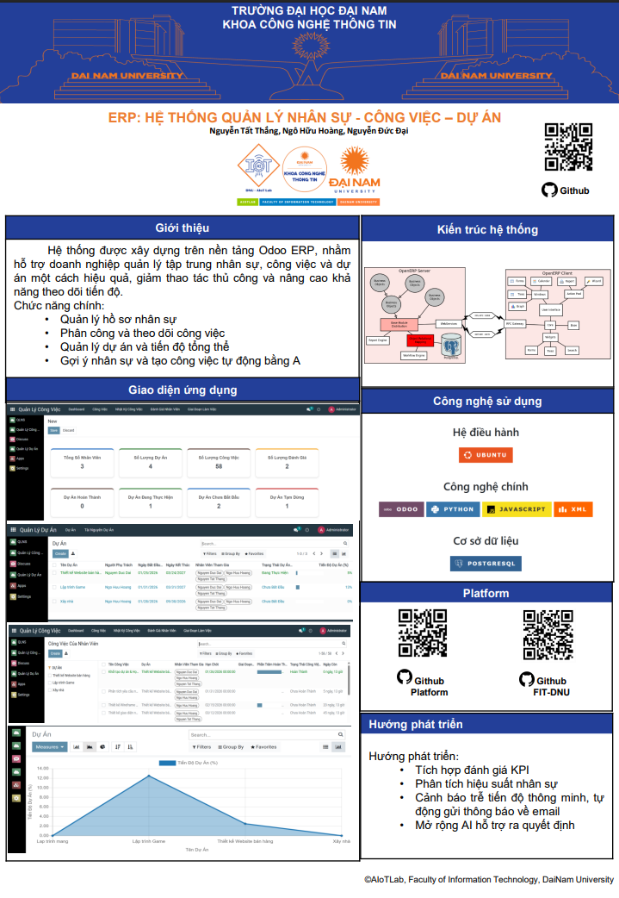

<h2 align="center">ERP: HỆ THỐNG QUẢN LÝ NHÂN SỰ - CÔNG VIỆC – DỰ ÁN
</h2>

<p align="center">
  <em>Dành cho học phần Thực tập doanh nghiệp</em>
</p>

<div align="center">
  <p align="center">
    
    
    
  </p>

  [](https://www.facebook.com/DNUAIoTLab)
  [](https://dainam.edu.vn/vi/khoa-cong-nghe-thong-tin)
  [](https://dainam.edu.vn)
</div>

---


[](https://github.com/PyCQA/bandit)

## 📌 Giới thiệu hệ thống

Hệ thống ERP được xây dựng trên nền tảng **Odoo**, phục vụ bài toán **quản lý nhân sự – công việc – dự án**.

Hệ thống cho phép:
- Quản lý hồ sơ nhân sự
- Phân công và theo dõi công việc
- Quản lý dự án và tiến độ tổng thể
- Gợi ý nhân sự và tạo công việc tự động bằng AI

Hình ảnh hệ thống: 
<p align="center">
  
</p>

## 📸 Giao diện & Chức năng

### Module quản lý nhân sự
| |  |
|:---:|:---:|
|  |  |
| *Giao diện chính quản lý nhân sự* | *Giao diện lịch sử công tác* |

|  |  
|:---:|
|  | 
| *Giao diện danh sách chứng chỉ bằng cấp* |  

### Module quản lý công việc
| |  |
|:---:|:---:|
|  |  |
| *Giao diện Dashboard* | *Giao diện danh sách công việc* |

| |  |
|:---:|:---:|
|  |  |
| *Giao diện nhật ký công việc* | *Giao diện đánh giá nhân viên* | 

|  |  
|:---:|
|  | 
| *Giao diện giai đoạn làm việc* |  

### Module quản lý dự án
| |  |
|:---:|:---:|
|  |  |
| *Giao diện chính quản lý dự án* | *Giao diện tài nguyên dự án* |

|  |  
|:---:|
|  | 
| *Giao diện biểu đồ tiến độ dự án* |  
# 1. Cài đặt dự án
## 1.1. Clone project.
```
https://github.com/nddchamhett/TTDN-16-02-N2.git
```
Hoặc nếu muốn clone base project
```
https://github.com/FIT-DNU/Business-Internship.git
```
## 1.2. cài đặt các thư viện cần thiết

Người sử dụng thực thi các lệnh sau để cài đặt các thư viện cần thiết

```
sudo apt-get install libxml2-dev libxslt-dev libldap2-dev libsasl2-dev libssl-dev python3.10-distutils python3.10-dev build-essential libssl-dev libffi-dev zlib1g-dev python3.10-venv libpq-dev
```
## 1.3. khởi tạo môi trường ảo.
```
python3.10 -m venv ./venv
```
## 1.4. Thay đổi trình thông dịch sang môi trường ảo.
```
source venv/bin/activate
```
## 1.5. Chạy requirements.txt để cài đặt tiếp các thư viện được yêu cầu
```
pip3 install -r requirements.txt
```
# 2. Setup database

Khởi tạo database trên docker bằng việc thực thi file dockercompose.yml.
```
sudo apt install docker-compose
```
```
sudo docker-compose up -d
```
Nếu dùng phiên bản mới chạy:
```
sudo docker compose up -d
```
Nếu lỗi có thể tải Docker Desktop về tại https://www.docker.com/get-started/
# 3. Setup tham số chạy cho hệ thống
## 3.1. Khởi tạo odoo.conf
Tạo tệp **odoo.conf**

```
nano odoo.conf
```
Nội dung **odoo.conf** như sau:

```
[options]
addons_path = addons
db_host = localhost
db_password = odoo
db_user = odoo
db_port = 5431
xmlrpc_port = 8069
```
Có thể kế thừa từ **odoo.conf.template**


# 4. Chạy hệ thống và cài đặt các ứng dụng cần thiết
Lệnh chạy tất cả module
```
python3 odoo-bin.py -c odoo.conf -u all
```
Lệnh chạy từng module
```
python3 odoo-bin.py -c odoo.conf -u [tên module] 
```

Người sử dụng truy cập theo đường dẫn _http://localhost:8069/_ để đăng nhập vào hệ thống.

# 5. Poster hệ thống

Poster hệ thống: 
<p align="center">
  
</p>

# 6. Nguồn tham khảo
Dự án có tham khảo và kế thừa tài nguyên từ:
- [TTDN-15-03-N6](https://github.com/HDatz/TTDN-15-03-N6) - HDatz

---


# 6 License
© 2024 AIoTLab, Faculty of Information Technology, DaiNam University. All rights reserved.
    
