# CÁC SƠ ĐỒ MERMAID CHO BÁO CÁO

## 1. Kiến trúc 3 tầng của ERP

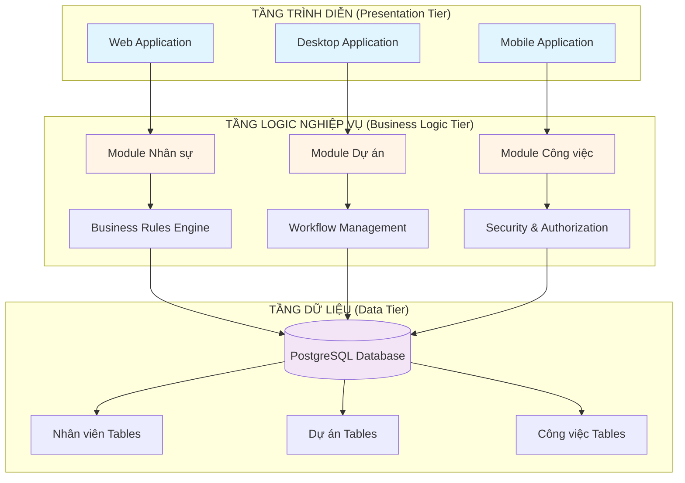

## 2. Kiến trúc Odoo (MVC)

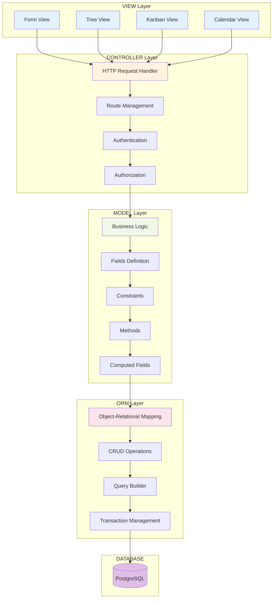

## 3. Quy trình quản lý dự án (PMBOK)

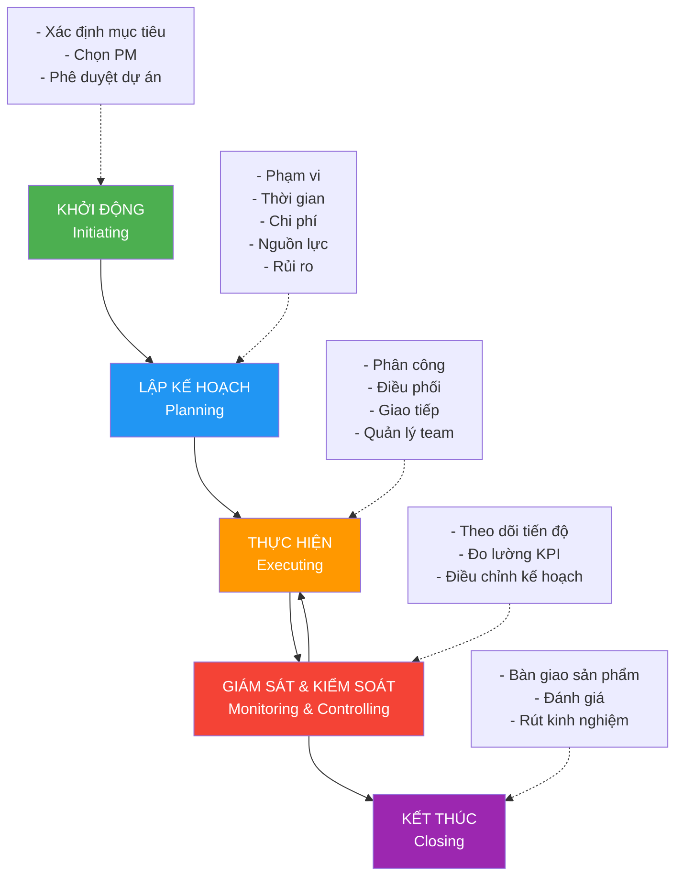

## 4. Mối quan hệ Dự án - Công việc - Nhân sự

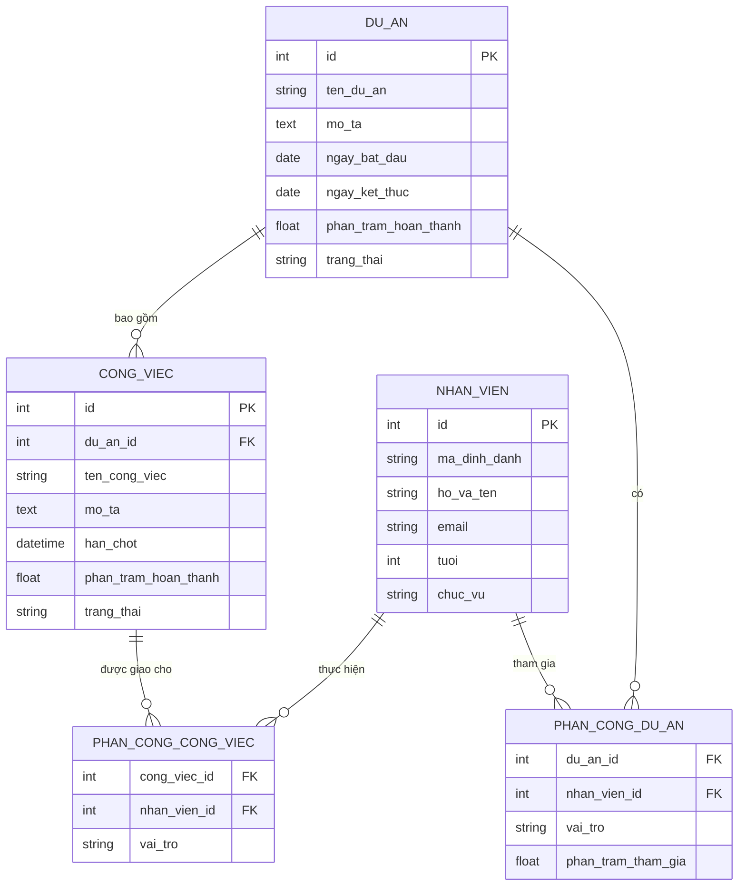

## 5. Kiến trúc tổng thể hệ thống

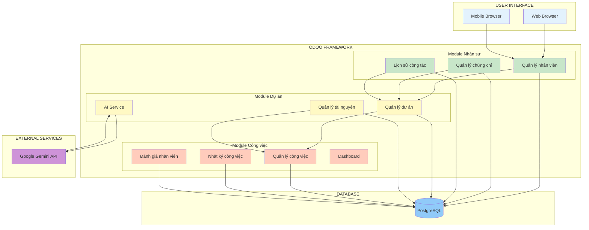

## 6. Luồng xử lý AI gợi ý nhân sự

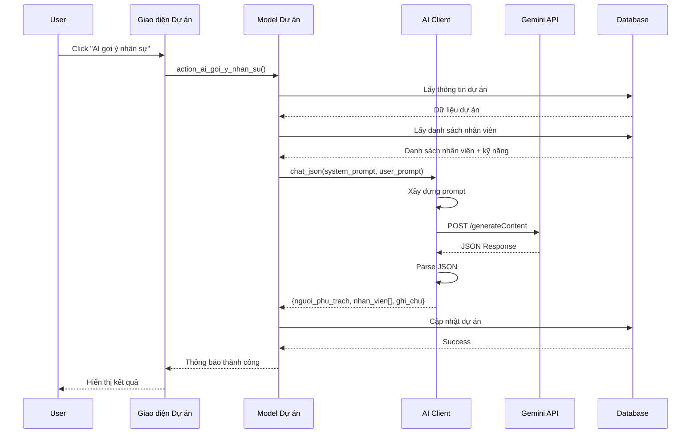

## 7. Luồng xử lý AI tạo công việc

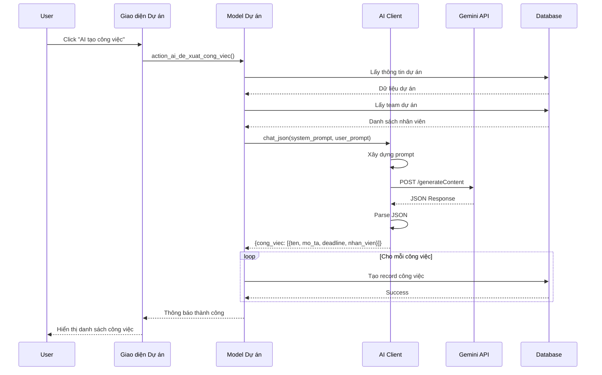

## 8. Sơ đồ Use Case tổng quan

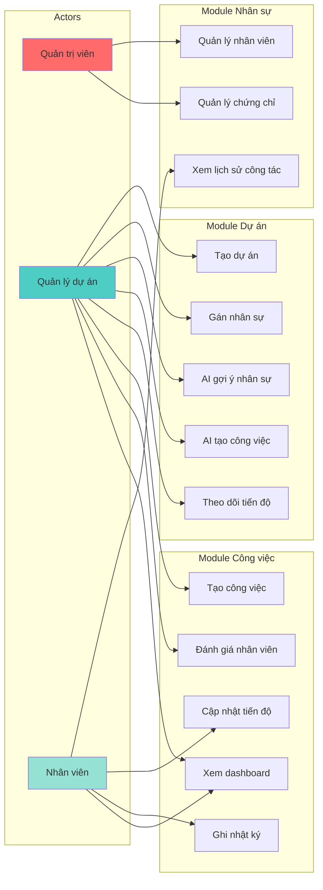

## 9. Sơ đồ trạng thái công việc

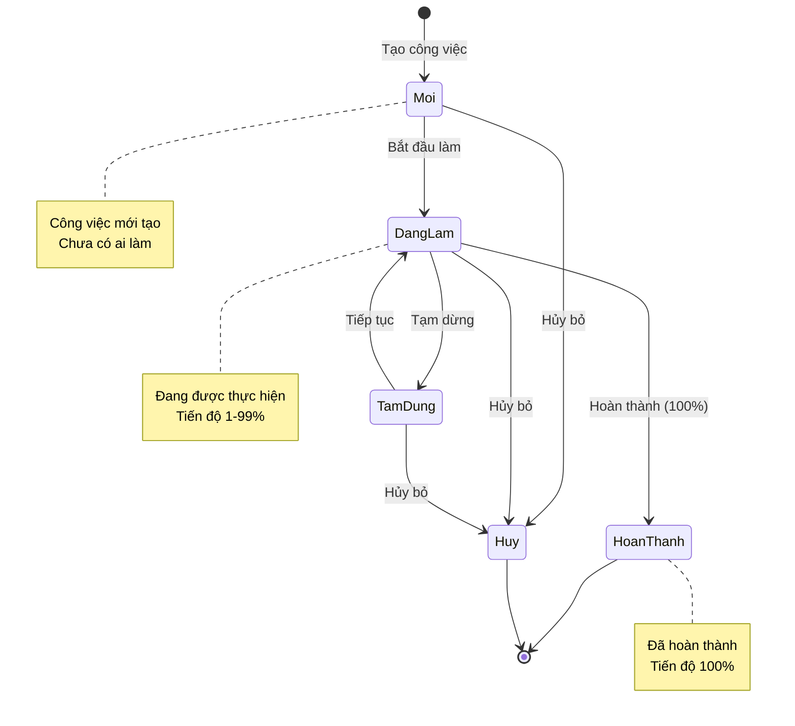

## 10. Sơ đồ trạng thái dự án

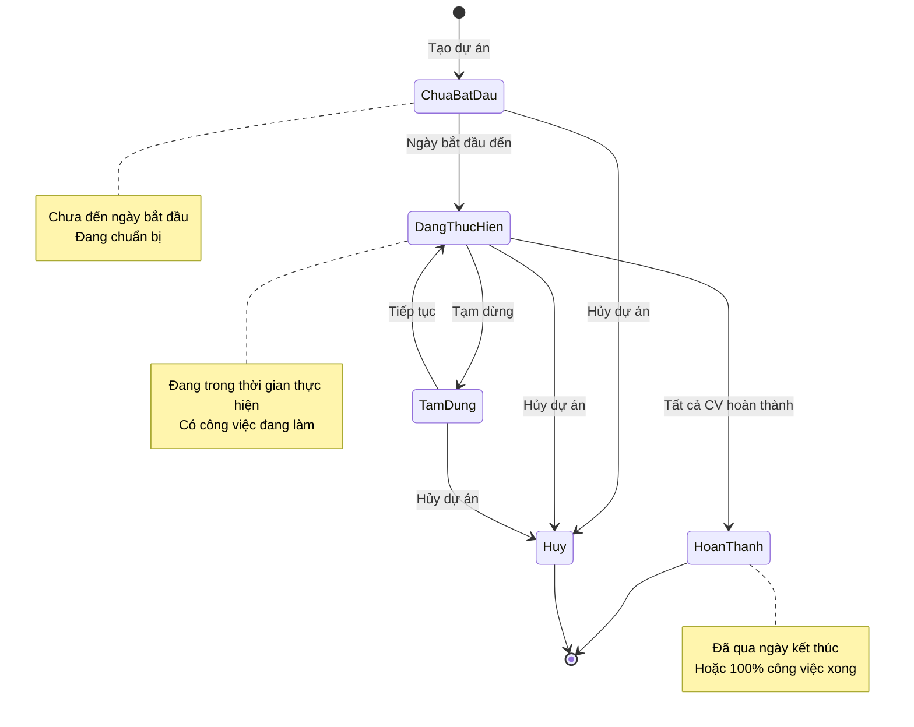

## 11. Biểu đồ Gantt mẫu cho dự án

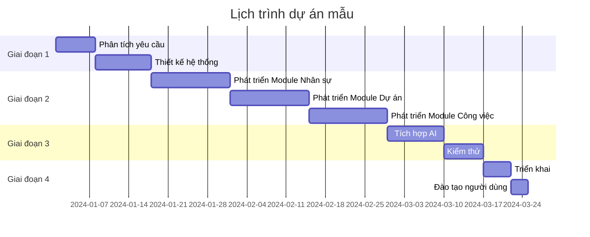

## 12. Biểu đồ phân bổ công việc theo nhân viên

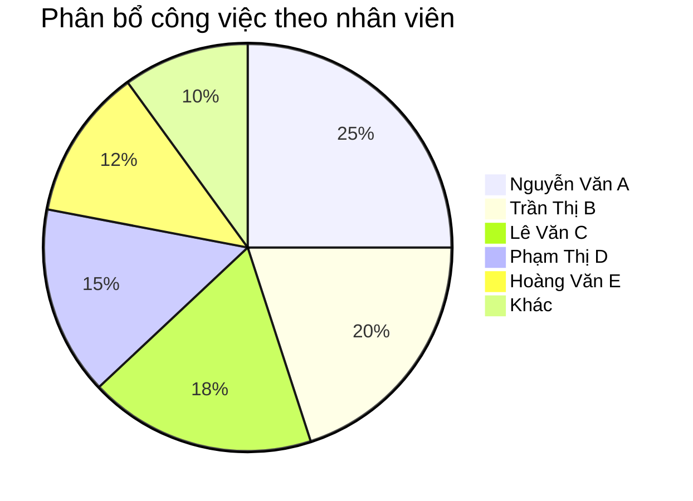

## 13. Biểu đồ tiến độ dự án

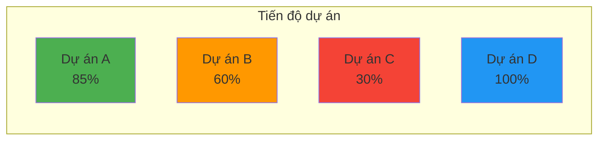

---

## Hướng dẫn sử dụng:

1. Truy cập https://mermaid.live/
2. Copy từng đoạn code mermaid ở trên
3. Paste vào editor bên trái
4. Xem kết quả bên phải
5. Click "Actions" → "Export as PNG/SVG" để tải về
6. Chèn ảnh vào báo cáo Word/PDF

**Lưu ý:** Một số sơ đồ phức tạp có thể cần điều chỉnh kích thước hoặc màu sắc để phù hợp với báo cáo của bạn.
